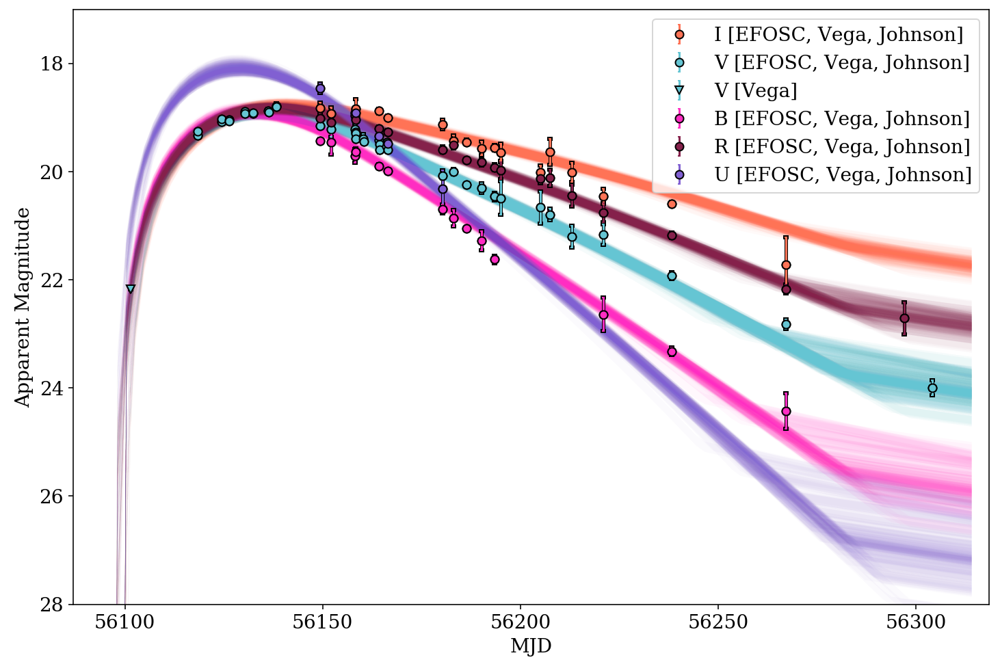

.. _getting-started:

===============
Getting started
===============
.. toctree::

Once installed, ``MOSFiT`` can be run from any directory, and it's typically convenient to make a new directory for your project.

.. code:: bash

    mkdir mosfit_runs
    cd mosfit_runs

``MOSFiT`` can be invoked either via either :code:`python -m mosfit` or simply :code:`mosfit`. Then, to run ``MOSFiT``, pass an event name to the program via
the ``-e`` option:

.. code-block:: bash

    mosfit -e LSQ12dlf

The above command will prompt the user to choose a model (of those distributed with ``MOSFiT``) to fit against the data, using the event's claimed type to provide a list of suggested models. A specific model can be fit to transients using the model option ``-m``:

.. code-block:: bash

    mosfit -e LSQ12dlf -m slsn

Multiple events can be fit in succession by passing a list of names separated by spaces (names containing spaces can be specified using quotation marks):

.. code-block:: bash

    mosfit -e LSQ12dlf SN2015bn "SDSS-II SN 5751"

The code outputs JSON files for each event/model combination that each contain a set of walkers that have been relaxed into an equilibrium about the posterior parameter distributions. This output is visualized via an example Jupyter notebook (``mosfit.ipynb``), which is copied to the ``products`` folder in the run directory, and by default shows output from the last ``MOSFiT`` run.

.. _parallel:

------------------
Parallel execution
------------------

``MOSFiT`` is parallelized and can be run in parallel by prepending ``mpirun -np #``, where ``#`` is the number of processors in your machine +1 for the master process. So, if you computer has 4 processors, the above command would be:

.. code-block:: bash

    mpirun -np 5 mosfit -e LSQ12dlf

``MOSFiT`` can also be run without specifying an event, which will yield a collection of light curves for the specified model described by the priors on the possible combinations of input parameters specified in the ``parameters.json`` file. This is useful for determining the range of possible outcomes for a given theoretical model:

.. code-block:: bash

    mpirun -np 5 mosfit -m magnetar

.. _own-data:

-------------------
Using your own data
-------------------

``MOSFiT`` has a built-in converter that can take input data in a number of formats and convert that data to the Open Catalog JSON format. Using the converter is straightforward, simply pass the path to the file(s) using the same ``-e`` option:

.. code-block:: bash

    mosfit -e my_ascii_data_file.csv

``MOSFiT`` will convert the files to JSON format and immediately begin processing the new files (append ``-G`` to immediately exit after conversion). For more information, please see the :ref:`Private data` section.

.. _producing-outputs:

-----------------
Producing outputs
-----------------

All outputs (except for converted observational data) are stored in the ``products`` directory, which is created by ``MOSFiT`` automatically in the current run directory. By default, a single file with the transient's name, e.g. ``LSQ12dlf.json``, will be produced; this file contains all of the information originally available in the input JSON file and the results of the fitting. An exact copy of this file is stored under the name ``walkers.json`` for convenience.

Additional outputs can be produced via some optional options that can be passed to ``MOSFiT``. Please see the :ref:`arbitrary outputs <arbitrary>` section.

.. _visualizing:

-------------------
Visualizing outputs
-------------------

The outputs from ``MOSFiT`` can be visualized using the Jupyter notebook ``mosfit.ipynb`` copied by the code into a ``jupyter`` directory within the current run directory. This notebook is intended to be a simple demonstration of how to visualize the output data, and can be modified by the users to their own needs.

First, the user should make sure that Jupyter is installed, then execute the Jupyter notebook from the run directory:

.. code-block:: bash

    jupyter notebook jupyter/mosfit.ipynb

In this notebook, there are four cells which should require minimal editing to visualize your results; the cells should be evaluated in order. The first cell imports modules and loads the data output from the last run (store in ``walkers.json``). The second cell displays the ensemble of light curve fits and the data the model was fitted to:

The third cell shows X-ray observations, if the transient had any.

The fourth cell shows the evolution of free parameters as a function of time (the Monte Carlo chain).

The last cell produces a corner plot using the `corner package <https://corner.readthedocs.io>`_.

.. _sharing:

-------------------------------------------
Sharing data and outputs with the community
-------------------------------------------

To upload fits back to the Open Catalogs, users can simply pass the ``-u`` option. The first time ``-u`` is used, MOSFiT will request a Dropbox token, which is provided on the Open Astronomy Catalogs on the pages describing ``MOSFiT``, e.g. `<https://sne.space/mosfit/>`_. These tokens can be revoked at any time, so a user may be occaisionally asked to enter a new token if the old one has expired.

Upon completing the fitting process, and if the fits satisfy some quality checks, the model fits will uploaded to the Open Catalogs, where they will be ingested and available approximately 24 hours after their submission.

If the data was read from a file (rather than from one of the Open Astronomy Catalogs), and if the ``-u`` option was provided, ``MOSFiT`` will offer the user the option of uploading the *observed* data to the Open Catalogs as well, in addition to the model fits. Because of the possibility that local data passed to ``MOSFiT`` is private, the user will be asked if they wish to upload each event before they are uploaded. Users should immediately contact the maintainers of ``MOSFiT`` if they believe they have uploaded private data in error (because of the 24 hour waiting period, the inadvertantly uploaded data can be purged before becoming public if the maintainers are given enough notice).

.. _troubleshooting:

---------------
Troubleshooting
---------------

If you are having trouble getting ``MOSFiT`` working, please first consult our :ref:`FAQ` page, which addresses many common issues. If the answers there do not answer your questions, feel free to join our `#mosfit Slack channel on AstroChats <https://slack.astrocats.space>`_ and ask for assistance.
