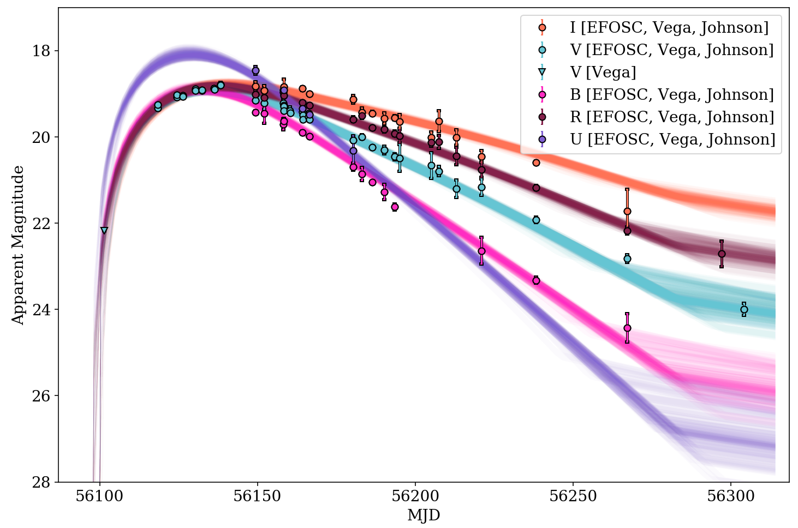

.. _getting-started:

===============
Getting started
===============
.. toctree::

Once installed, ``MOSFiT`` can be run from any directory, and it's typically convenient to make a new directory for your project.

.. code:: bash

    mkdir mosfit_runs
    cd mosfit_runs

``MOSFiT`` can be invoked either via :code:`python -m mosfit` or simply :code:`mosfit` (or ``uv run mosfit`` from a source checkout). Pass **paths** to catalog-format JSON (or ASCII for conversion) with ``-e``. The default sampler is ``dynesty`` (see :ref:`sampling`).

.. code-block:: bash

    mosfit -e ./LSQ12dlf.json

The above command will prompt the user to choose a model (of those distributed with ``MOSFiT``) to fit against the data, using the event's claimed type to provide a list of suggested models. A specific model can be specified with ``-m``:

.. code-block:: bash

    mosfit -e ./LSQ12dlf.json -m slsn
    mosfit -e mosfit/tests/PS1-10jh.json -m tde --max-cores 10 -R

Multiple JSON files can be fit in succession (paths with spaces in quotes):

.. code-block:: bash

    mosfit -e ./LSQ12dlf.json ./SN2015bn.json

The code writes ``products/walkers.h5`` for each event/model combination: a set of walkers relaxed about the posterior, merged with the input event catalog. An example Jupyter notebook (``mosfit.ipynb``) is copied into the ``jupyter/`` folder in the run directory and, by default, visualizes the last ``MOSFiT`` run.

.. _parallel:

------------------
Parallel execution
------------------

Likelihood evaluations can be spread across local processes with ``--max-cores``
(Windows-spawn compatible; default is 1, i.e. serial). This is the usual way
to use multiple cores with the default ``dynesty`` sampler:

.. code-block:: bash

    mosfit -e ./LSQ12dlf.json -m slsn --max-cores 10

MPI is still supported when ``mpi4py`` is installed (``uv sync --extra mpi``).
Prepend ``mpirun``/``mpiexec``; ``mpirun`` takes precedence over ``--max-cores``.
``#`` is typically the number of ranks you want (often cores + 1 for a master
process with some MPI setups):

.. code-block:: bash

    mpirun -np 5 mosfit -e ./LSQ12dlf.json

``MOSFiT`` can also be run without specifying an event, which will yield a collection of light curves for the specified model described by the priors on the possible combinations of input parameters specified in the ``parameters.json`` file. This is useful for determining the range of possible outcomes for a given theoretical model:

.. code-block:: bash

    mosfit -m magnetar --max-cores 10

.. _own-data:

-------------------
Using your own data
-------------------

``MOSFiT`` has a built-in converter that can take input data in a number of formats and convert that data to the Open Catalog JSON format. Using the converter is straightforward, simply pass the path to the file(s) using the same ``-e`` option:

.. code-block:: bash

    mosfit -e my_ascii_data_file.csv

``MOSFiT`` will convert the files to JSON format and immediately begin processing the new files (append ``-G`` to immediately exit after conversion). For more information, please see :ref:`ASCII / catalog JSON <private>`.

.. _producing-outputs:

-----------------
Producing outputs
-----------------

All outputs (except for converted observational data) are stored in the ``products`` directory, which is created by ``MOSFiT`` automatically in the current run directory. By default (without ``--quick-save``), the main fit results are stored in fixed filenames under ``products``—chiefly ``walkers.h5``—which merges the information from the original event JSON with the walkers produced by sampling. Passing ``--quick-save`` instead writes similarly named output files prefixed by the transient name (see :ref:`io`).

Additional outputs can be produced via some optional options that can be passed to ``MOSFiT``. Please see the :ref:`arbitrary outputs <arbitrary>` section.

.. _visualizing:

-------------------
Visualizing outputs
-------------------

The outputs from ``MOSFiT`` can be visualized using the Jupyter notebook ``mosfit.ipynb`` copied by the code into a ``jupyter`` directory within the current run directory. This notebook is intended to be a simple demonstration of how to visualize the output data, and can be modified by users for their own needs.

First, make sure Jupyter (and the optional ``corner`` package) are installed, then open the notebook from the run directory:

.. code-block:: bash

    jupyter notebook jupyter/mosfit.ipynb

Evaluate the cells in order. The notebook:

1. Loads ``walkers.h5`` from ``products/`` (or a path set via the ``MOSFIT_WALKERS`` environment variable).
2. Plots the photometric light-curve ensemble against the fitted data (saved as ``products/lc.pdf``):

3. Plots bolometric luminosity / absolute magnitude if luminosity rows are present in the walkers file.
4. Plots free-parameter traces from ``products/chain.h5`` when the fit was run with ``-c``.
5. Produces a corner plot with the `corner package <https://corner.readthedocs.io>`_ (saved as ``products/corner.pdf``).

.. _sharing:

-------------------------------------------
Outputs and provenance
-------------------------------------------

Runs write products under ``products/``—chiefly ``walkers.h5`` (walkers + model metadata), and optionally ``chain.h5`` (with ``-c``) and ``extras.json`` (with ``-x``). This fork does **not** upload fits or observations anywhere: distribution, archiving, and DOIs are your responsibility (e.g. Zenodo, your collaboration’s pipeline, version-controlled paths + hashes).

Treat ``products/walkers.h5`` as the canonical deliverable for reproducibility alongside the exact input catalog JSON (or ASCII) and a pinned ``MOSFiT`` commit or release. Legacy ``walkers.json`` files are still readable.

.. _troubleshooting:

---------------
Troubleshooting
---------------

If you are having trouble getting ``MOSFiT`` working, please first consult our :ref:`FAQ` page, which addresses many common issues. If the answers there do not answer your questions, feel free to join our `#mosfit Slack channel on AstroChats <https://slack.astrocats.space>`_ and ask for assistance.
